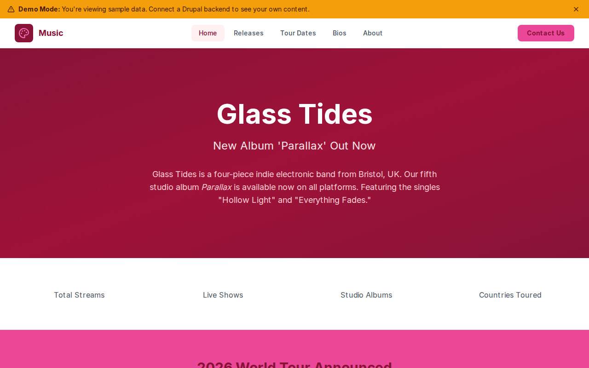

# Decoupled Music

A headless Drupal + Next.js starter kit for music artists and bands. Built for musicians, record labels, and music managers who need a modern, performant website to showcase releases, tour dates, and band member profiles.



## Features

- **Releases** -- Showcase albums, EPs, and singles with cover art, tracklists, genre tags, and streaming links
- **Tour Dates** -- Display upcoming and past live performances with venue details, ticket links, and sold-out indicators
- **Band Bios** -- Present band member profiles with roles, influences, and photos
- **Homepage** -- Dynamic hero section with stats (streams, shows, albums, countries toured) and featured releases
- **Basic Pages** -- Static content for About, Contact & Bookings, and more
- **Demo Mode** -- Ships with sample content from a fictional band (Glass Tides) for instant preview

## Quick Start

```bash
# Clone the starter
npx degit nicoschi/decoupled-music my-music-site
cd my-music-site

# Install dependencies
npm install

# Run interactive setup
npm run setup

# Start development
npm run dev
```

Open [http://localhost:3000](http://localhost:3000) to see the demo site.

## Manual Setup

1. **Create a Drupal Space** at [Decoupled](https://app.decoupled.dev)

2. **Import Content** -- Use the DC Import API or MCP tools to import `data/music-content.json`. This creates:
   - 3 releases: *Parallax*, *Hollow Light* (single), *Afterimage*
   - 4 tour dates: London Roundhouse, Berlin Columbiahalle, Brooklyn Steel, Tokyo Garden Hall
   - 4 band bios: Lena Voss (vocals), Tom Ashford (guitar), Sara Kim (bass/synths), Jake Okoye (drums)
   - 2 pages: About Glass Tides, Contact & Bookings

3. **Configure Environment Variables** -- Copy `.env.local.example` to `.env.local` and fill in your Drupal credentials:
   ```
   NEXT_PUBLIC_DRUPAL_BASE_URL=https://your-space.decoupled.website
   DRUPAL_CLIENT_ID=your-client-id
   DRUPAL_CLIENT_SECRET=your-client-secret
   DRUPAL_REVALIDATE_SECRET=your-revalidate-secret
   ```

4. **Generate the GraphQL schema** and start developing:
   ```bash
   npm run generate-schema
   npm run dev
   ```

## Content Types

### Release
Music releases including albums, EPs, and singles.

| Field | Type | Description |
|-------|------|-------------|
| Release Format | Term (release_formats) | Album, EP, single, live, remix, compilation |
| Genre | Term (genres) | Indie-rock, electronic, dream-pop, post-punk, shoegaze, ambient |
| Release Date | DateTime | Official release date |
| Track Count | Integer | Number of tracks |
| Duration | String | Total runtime |
| Record Label | String | Label name |
| Cover Art | Image | Album/single artwork |
| Tracklist | String[] | Ordered list of track names |
| Streaming URL | String | Link to streaming platform |

### Tour Date
Upcoming and past tour dates and live performances.

| Field | Type | Description |
|-------|------|-------------|
| Event Date | DateTime | Show date and time |
| Venue Name | String | Name of the venue |
| City | String | City name |
| Country | String | Country name |
| Ticket URL | String | Link to purchase tickets |
| Ticket Price | String | Formatted price |
| Sold Out | Boolean | Whether the show is sold out |
| Support Act | String | Opening act |
| Image | Image | Venue or event photo |

### Bio
Band member biographies and profiles.

| Field | Type | Description |
|-------|------|-------------|
| Role/Instrument | String | Member's role in the band |
| Year Joined | String | Year the member joined |
| Influences | String[] | Musical influences |
| Photo | Image | Member headshot |

### Homepage
Dynamic homepage with hero, stats, featured releases, and call-to-action.

### Basic Page
Static content pages (About, Contact, etc.).

## Customization

- **Styling** -- Tailwind CSS configuration in `tailwind.config.js`. The starter uses a rose/pink color palette.
- **Navigation** -- Edit `app/components/Header.tsx` to add or remove nav items.
- **Footer** -- Customize links and contact info in `app/components/HomepageRenderer.tsx`.
- **Taxonomies** -- Release formats and genres are configurable via Drupal taxonomy vocabularies.

## Demo Mode

The starter ships with a `DemoModeBanner` component that displays a banner when running in demo mode. To remove it for production, delete the import and component from `app/layout.tsx`.

## Deployment

Deploy to any platform that supports Next.js:

- **Vercel** -- Zero-config deployment. Set environment variables in the Vercel dashboard.
- **Netlify** -- Use the Next.js adapter.
- **Self-hosted** -- Run `npm run build && npm start`.

## Documentation

- [Decoupled Drupal Docs](https://docs.decoupled.dev)
- [Next.js Documentation](https://nextjs.org/docs)
- [Tailwind CSS](https://tailwindcss.com/docs)

## License

MIT
